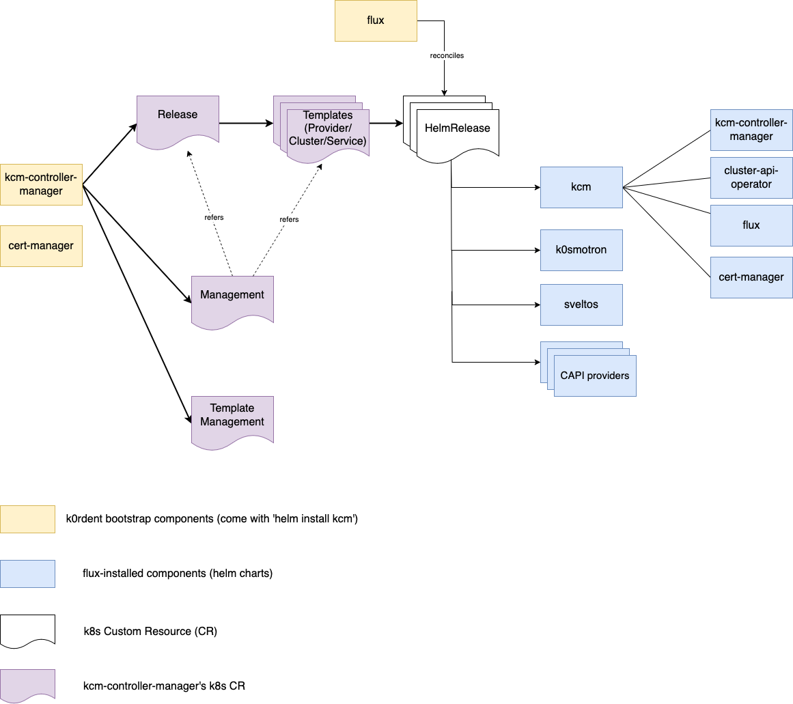

# k0rdent initialization process

## The process

1. [helm install kcm](../quick-start/installation.md#installation-via-helm) brings up the bootstrap components (yellow on the picture above)
1. kcm-controller-manager set up webhooks to validate its CRs, then cert-manager handles the webhooks’ certificates
1. kcm-controller-manager generates *Release* object corresponding to the kcm helm chart version
1. kcm-controller-manager ([release-controller](https://github.com/k0rdent/kcm/blob/main/internal/controller/release_controller.go) inside it) generates template objects (*ProviderTemplate/ClusterTemplate/ServiceTemplate*) corresponding to *Release* to be further processed
1. kcm-controller-manager generates *HelmRelease* object for every template from p.3 (Important: it includes also kcm helm chart itself)
1. [Flux](https://github.com/fluxcd/flux2) (source-controller and helm-controller pods) reconciles the *HelmRelease* objects i.e. installs all the helm charts referred to in the templates.
**After this point the deployment is completely controlled by Flux.**
1. kcm-controller-manager creates a Management object which refers to the above *Release* and the *ProviderTemplate* objects.
*Management* object represents the k0rdent management cluster as a whole.
The management cluster Day-2 operations (such as [upgrade](../usage/upgrade.md)) are being executed by manipulating the *Release* and *Management* objects.
1. kcm-controller-manager generates an empty *AccessManagement* object. *AccessManagement* defines [access rules](../template/main.md/#template-life-cycle-management) for *ClusterTemplate*/*ServiceTemplate* propagation across user namespaces. Further *AccessManagement* might be edited and used along with admin-created *ClusterTemplateChain* and *ServiceTemplaitChain* objects.
