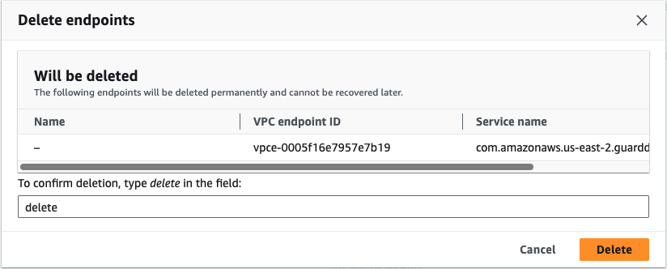
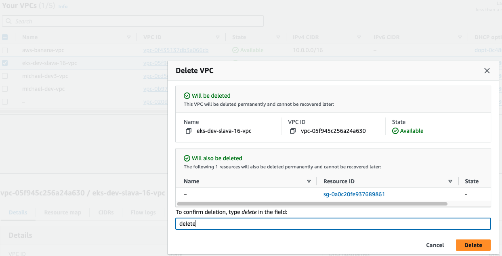

# Non-removed VPC

A bug was fixed in CAPA (Cluster API Provider AWS) for VPC removal: [kubernetes-sigs/cluster-api-provider-aws#5192](https://github.com/kubernetes-sigs/cluster-api-provider-aws/issues/5192)

It is possible to deal with non-deleted VPCs the following ways:

## Applying ownership information on VPCs

When VPCs have owner information, all AWS resources will be removed when k0rdent EKS cluster is deleted.
So, after provisioning EKS cluster the operator can go and set tags (i.e. `tag:Owner`) and it will be sufficient for CAPA to manage them.

## GuardDuty VPCE

Another way to prevent an issue with non-deleted VPCs is to disable GuardDuty.
GuardDuty creates an extra VPCE (VPC Endpoint) not managed by CAPA and when CAPA starts EKS cluster removal, this VPCE is not removed.

## Manual removal of VPCs

When it is impossible to turn off GuardDuty or applying ownership tags is not permitted, it is needed to remove VPCs manually.

The sign of “stuck” VPC looks like a hidden “Delete” button.

Opening “Network Interfaces” and attempting to detach an interface shows disable “Detach” button:

It is required to get to VPC endpoints screen and remove the end-point: 

Wait until VPCE is completely removed, all network interfaces disappear.

Now VPC can be finally removed:

